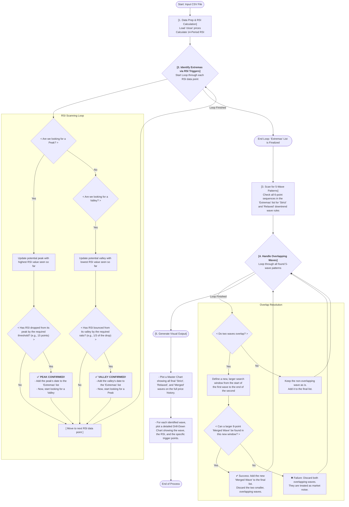

```mermaid
graph TD
    A([Start: Input CSV File]);
    B["[1. Data Prep & RSI Calculation]\nLoad 'close' prices\nCalculate 14-Period RSI"];
    C{"<div style='padding: 10px; border: 2px solid #2ecc71; border-radius: 5px;'><b>[2. Identify Extremas via RSI Triggers]</b><br/>Start Loop through each RSI data point</div>"};
    
    A --> B --> C;

    subgraph "RSI Scanning Loop"
        D{"< Are we looking for a Peak? >"};
        E["Update potential peak with highest RSI value seen so far"];
        F{"< Has RSI dropped from its peak by the required threshold? (e.g., 15 points) >"};
        G["✅ <b>PEAK CONFIRMED!</b><br/>- Add the peak's date to the 'Extremas' list<br/>- Now, start looking for a Valley"];
        
        H{"< Are we looking for a Valley? >"};
        I["Update potential valley with lowest RSI value seen so far"];
        J{"< Has RSI bounced from its valley by the required ratio? (e.g., 1/3 of the drop) >"};
        K["✅ <b>VALLEY CONFIRMED!</b><br/>- Add the valley's date to the 'Extremas' list<br/>- Now, start looking for a Peak"];
        L["[ Move to next RSI data point ]"];
    end

    C --> D;
    D -- Yes --> E --> F;
    F -- No --> L;
    F -- Yes --> G --> L;
    D -- No --> H;
    H -- Yes --> I --> J;
    J -- No --> L;
    J -- Yes --> K --> L;
    L --> C;

    M([End Loop: 'Extremas' List is Finalized]);
    N["[3. Scan for 5-Wave Patterns]\nCheck all 6-point sequences in the 'Extremas' list for 'Strict' and 'Relaxed' downtrend wave rules"];
    O{"<div style='padding: 10px; border: 2px solid #3498db; border-radius: 5px;'><b>[4. Handle Overlapping Waves]</b><br/>Loop through all found 5-wave patterns</div>"};
    
    C -- Loop Finished --> M;
    M --> N --> O;

    subgraph "Overlap Resolution"
        P{"< Do two waves overlap? >"};
        Q["Define a new, larger search window from the start of the first wave to the end of the second"];
        R{"< Can a larger 8-point 'Merged Wave' be found in this new window? >"};
        S["✔ Success: Add the new 'Merged Wave' to the final list.<br/>Discard the two smaller, overlapping waves."];
        T["✖ Failure: Discard both overlapping waves.<br/>They are treated as market noise."];
        U["Keep the non-overlapping wave as is.<br/>Add it to the final list."];
    end
    
    O --> P;
    P -- Yes --> Q --> R;
    R -- Yes --> S;
    R -- No --> T;
    P -- No --> U;
    
    V(["[5. Generate Visual Output]"]);
    W["- Plot a Master Chart showing all final 'Strict', 'Relaxed', and 'Merged' waves on the full price history."];
    X["- For each identified wave, plot a detailed Drill-Down Chart showing the wave, the RSI, and the specific trigger points."];
    Y([End of Process]);

    S --> O;
    T --> O;
    U --> O;
    O -- Loop Finished --> V;
    V --> W --> X --> Y;
```